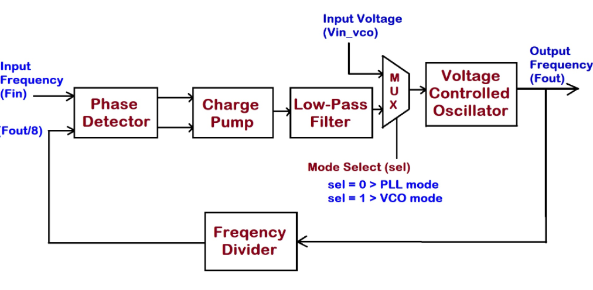
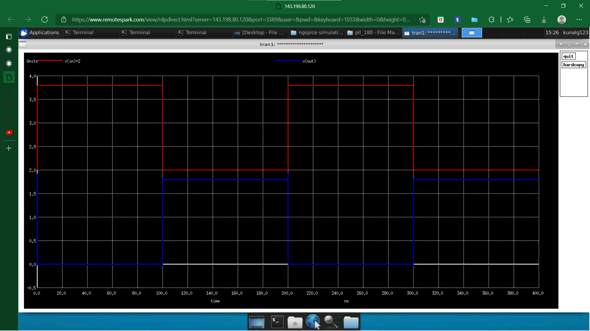

This is intense workshop to design PLL using 180nm PDK, steps > design, simulate, layout.  
---

## Table of contents

- [PLL_OSU180nm_VSD](#pll_osu180nm_vsd)
  - [Table of contents](#table-of-contents)
  - [Introduction](#introduction)
  - [Design Specifications](#design-specifications)
  - [Tools used](#tools-used)
  - [Theory](#theory)
    - [Phase Locked Loop](#phase-locked-loop)
      - [Clock multiplier using PLL](#clock-multiplier-using-pll)
      - [Phase frequency detector](#phase-frequency-detector)
      - [Charge pump and RC filter](#charge-pump-and-rc-filter)
      - [Voltage Controlled Oscillator](#voltage-controlled-oscillator)
      - [Frequency divider](#frequency-divider)
- [Pre-layout simulation](#pre-layout-simulation)
    - [1) Inverter (example)](#1-inverter-example)
      - [Esim netlist](#esim-netlist)
      - [Modifications](#modifications)
      - [Running simulation](#running-simulation)
    - [3) NAND gates](#3-nand-gates)
      - [2 input NAND](#2-input-nand)
      - [3 input NAND](#3-input-nand)
      - [4 input NAND](#4-input-nand)
    - [3) Phase detector](#3-phase-detector)
    - [4) Phase detector with RC filter and charge pump](#4-phase-detector-with-rc-filter-and-charge-pump)
    - [5) Voltage Controlled Oscillator](#5-voltage-controlled-oscillator)
    - [6) Clock divider](#6-clock-divider)
    - [Pre-layout simulation of whole circuit](#pre-layout-simulation-of-whole-circuit)

## Introduction


Phase-detector : Based on the feedback from the frequency divider it creates two signals ,up and down which are given to the charge-pump<br />
Charge pump : Charge-pump consists of power MOSFETS it helps in better charging of the capacitors present in the next stage which is a LPF<br />
LPF : LPF is used for smoothning the waveform and get a dc value<br />
MUX : Here MUX is used to select between VCO only mode or PLL<br />
VCO : VCO is used to get the output frequency based on the input DC value<br />
Frequency divider :Here a basic D-Filp-flop based counter is used to get frequency division

---

## Design Specifications 
| Parameter| Description| Min | Type | Max | Unit | Condition |
| :---:  | :-: | :-: | :-: | :---:  | :-: | :-: |
|VDD|Digital supply voltage||1.8||V|T=-40 to 150C|
|FCLKREF|Reference clock frequency|5|10|12.5|MHz||	
|FCLKOUT|Output clock frequency|39.7|80.91|99.81|MHz|PLL mode, T=27C, VDD=1.8|
|FCLKOUT|Output clock frequency||||MHz|VCO mode, T=27C, VDD=1.8|
|DC|Duty Cycle|48||52|%|T=-40 to 150C|
|IBCP|Bias current for VCO||||uA||
|VVCO|Oscillatror control input voltage|.557||0.62|V|Vin_vco = 0V at t = 0 (.uic)|
|JRMS|Jitter (rms)||future work||ps|PLL mode, FCLKREF = 10MHz|
|TSET|Settlng Time|5.2|5|4.6|us|start from EN_CP and report 2 values; one at FCLKOUT=40MHz and one at FCLKOUT=100MHz|
|CL|Load Capacitance||||pF||
|IDDA|Analog Supply current||||ua|VVCO=0.8V, VCO mode|
|IDDA|Analog Supply current||||ua|FCLKREF=10MHz, PLL mode|
|IDDA|Analog Supply current||||pa|EN_VCO=0, EN_CP=0, FCLKREF=0|
|IDDD|Digital Supply Current||||uA|VVCO=0.8V, VCO mode|
|IDDD|Digital Supply Current||||uA|FCLKREF=10MHz, PLL mode|
|IDDD|Digital Supply Current||||uA|EN_VCO=0, EN_CP=0, FCLKREF=0|

## Basic inverter simulation 
### Pre-layout simulation

Pre-layout simulation is done using ngspice netlists generated from esim.

---

### 1) Inverter (example)

The netlist generated from esim needs to be modified to run the simulation:
modifications -> to include the library or model file
              -> add control statements 

File : [```documents/inv101.cir```](documents/inv101.cir)
```
*********************
*inverter simulation
*********************

.include osu018.lib


M1 out in GND GND nfet l=180n w=180n
M2 VDD in out VDD pfet l=180n w=360n


V1 in 0 PULSE 0 1.8 10p 50p 50p 100n 200n
V2 VDD 0 1.8

.control
tran 0.01ns 400ns
plot v(in)+2 v(out)
.endc

.end
```
#### Running simulation

We run the simulation by invoking the command ```ngspice inv101.cir``` where ```inv101.cir``` is the name of the spice netlist. The output looks like :




---
